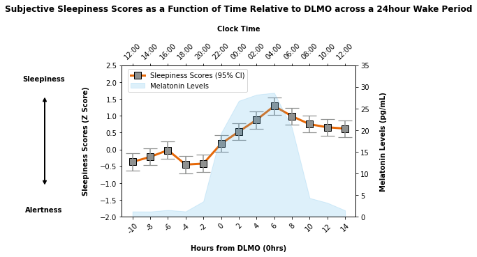

# 📈 Circadian Time-Series Data Visualisation in Python


## Overview

As a circadian scientist interested in human behaviour, I work with time-series data that capture changes across daily cycles, often over periods of 12–24 hours. These datasets contain complex patterns that are closely linked to the timing of biological rhythms. For example, daily rhythms in alertness and cognitive performance follow similar patterns to core body temperature ([Dijk, et al., 1992](https://doi.org/10.1111/j.1365-2869.1992.tb00021.x)).

It is important to visualise data in a way that reflects the influence of the body's internal clock rather than relying only on standard clock time. In this repository, I show figures that were created during my PhD to visualise subjective sleepiness, cognitive performance, and neurophysiological data relative to DLMO (dim light melatonin onset). 

## Project

In this example dataset, participants remain awake under controlled laboratory conditions for 24-hours. Subjective sleepiness ratings are recorded every two hours, along with saliva samples to measure melatonin levels. The data are aligned relative to DLMO. 

This visualisation illustrates how sleepiness and alertness change across the sleep-wake cycle relative to a biological marker of circadian timing. The plot uses dual x and y axes to display time relative to DLMO alongside the corresponding clock time and sleepiness and melatonin levels. 

### Example Data

The example dataset can be found here: [Example Dataset](Example_Data.csv)

** Data Privacy Note** 

The datasets included here are examples created to demonstrate how to create the plots. They do not contain real participant information or represent actual study results.

### Using matplotlib to create a visualisation of the example sleepiness data 

Import the appropriate libraries 

```python
import numpy as np
import pandas as pd
import matplotlib.pyplot as plt
```

Load the dataset as a pandas DataFrame 

```python
df = pd.read_csv("Example_Data.csv")
```

Create a plot that has four axes 

```python
fig, ax1 = plt.subplots()
ax2 = ax1.twinx()
ax3 = ax1.twiny()
```

Plot the data from sleepiness data, with time from DLMO on the x axis and sleepiness scores and melatonin levels on the y axes 

```python
ax2.fill_between(df["Circadian_Time"], df["Melatonin_Value"], color="#56B4E9", alpha=0.2, label="Melatonin Levels")
ax1.plot(df["Circadian_Time"], df["Sleepiness_Z_Score"], color="#E66808", marker="s", markerfacecolor = "#8F9190", 
         markeredgecolor= "#000000", markersize=10, linewidth=3, label="Sleepiness Scores (95% CI)")
```

Add lower and upper confidence intervals 

```python
yerr = np.array([
    pd.to_numeric(df["Sleepiness_Z_Score"]) - pd.to_numeric(df["Sleepiness_Lower"]), 
    pd.to_numeric(df["Sleepiness_Upper"]) - pd.to_numeric(df["Sleepiness_Z_Score"]) 
])
x = df["Circadian_Time"]
ax1.errorbar(
    x, df["Sleepiness_Z_Score"],
    yerr=yerr,
    fmt='o', color="#8F9190", capsize=10, capthick=1.2)
```

Create title, labels, and ticks. Clock time is added as a top x axis and corresponds to time from DLMO

```python
ax1.set_title("Subjective Sleepiness Scores as a Function of Time Relative to DLMO across a 24hour Wake Period", 
              weight="bold", pad=20)
ax1.set_ylim(-2, 2.5)
ax1.set_xlabel("Hours from DLMO (0hrs)", weight="bold", labelpad=15)
ax1.set_xticklabels(df["Circadian_Time"], rotation=45)
ax1.set_ylabel("Sleepiness Scores (Z Score)", weight="bold", labelpad=15)

ax2.set_ylim(0, 35)
ax2.set_ylabel("Melatonin Levels (pg/mL)", weight="bold", labelpad=15)

ax3.set_xlim(ax1.get_xlim())
ax3.set_xticks(ax1.get_xticks())
ax3.set_xticklabels(df["Clock Time"], rotation=45 )
ax3.set_xlabel("Clock Time", weight="bold", labelpad=15)
```

Create legend for both axes

```python
h1, l1 = ax1.get_legend_handles_labels()
h2, l2 = ax2.get_legend_handles_labels()
ax1.legend(h1 + h2, l1 + l2, loc="upper left", bbox_to_anchor=(0.01, 0.999))
```

Create an annotation on the plot to indicate increased scores reflect sleepiness

```python
ax1.text(-5,2, "Sleepiness", size=10, ha="center", va="bottom", weight="bold")
ax1.text(-5,-1.7, "Alertness", size=10, ha="center", va="top", weight="bold")
ax1.annotate("", xy=(-0.33, 0.2), xytext=(-0.33, 0.8),
             xycoords="axes fraction", textcoords="axes fraction",
             arrowprops=dict(arrowstyle="<->", lw=2), clip_on=False)
```

## Result


